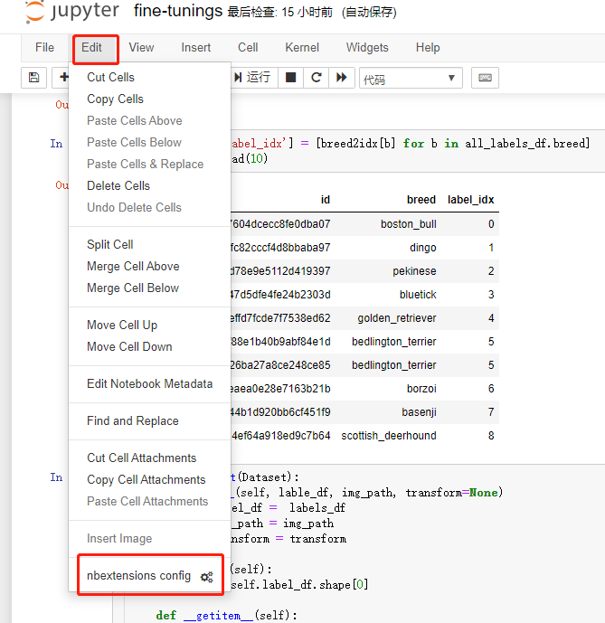
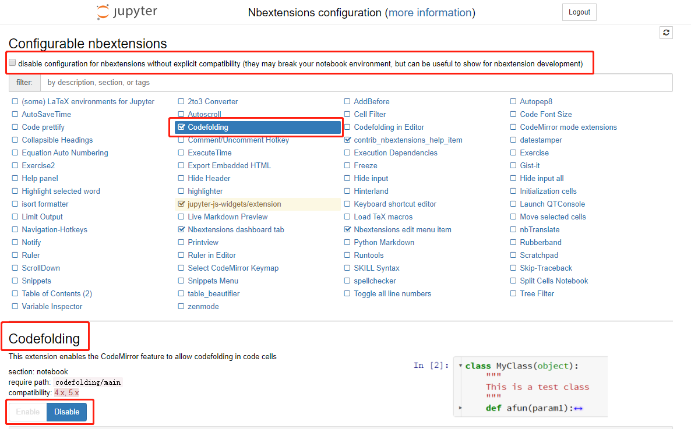

# Jupyter Notebook

## 参考资源

[笔记本扩展列表--官网](https://jupyter-contrib-nbextensions.readthedocs.io/en/latest/nbextensions.html)

[如何优雅地使用 Jupyter？--知乎](https://www.zhihu.com/question/59392251)

[你真的会用Jupyter吗？这里有7个进阶功能助你效率翻倍](https://blog.csdn.net/yh0vlde8vg8ep9vge/article/details/85333338)

## 生成矢量图，在放大图片的同时不会默认生成的PNG图片一样失真

```python
%config InlineBackend.figure_format = 'svg'
```

## 安装Jupyter Notebook 插件

```python
conda install -c conda-forge jupyter_contrib_nbextensions
conda install -c conda-forge jupyter_nbextensions_configurator
```
## 启用jupyter Notebook 插件

```python
jupyter nbextension enable codefolding/main
jupyter nbextension disable codefolding/main
```
或者通过可视化界面来操作




## 插件

### Hinterland 

为代码单元中的每个按键启用代码自动完成菜单，而不仅仅是使用tab调用它。

### codefolding

此扩展将代码折叠功能从CodeMirror添加到代码单元。

### Snippets

Snippets在工具栏里加了一个下拉菜单，可以非常方便的直接插入代码段，完全不用手动敲。

<!-- ### Code prettify

一键美化代码，强迫症的福音。 -->

### Auto PEP8

Python代码规范