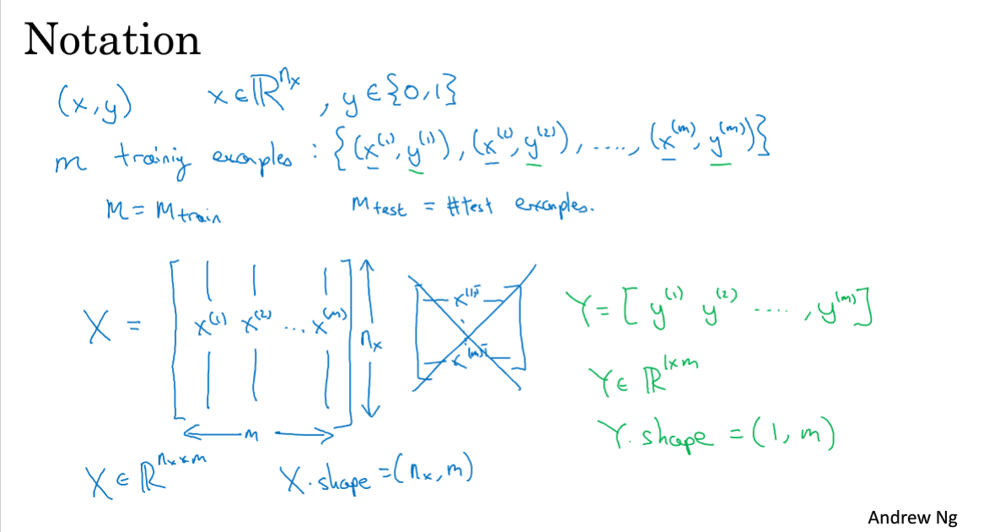
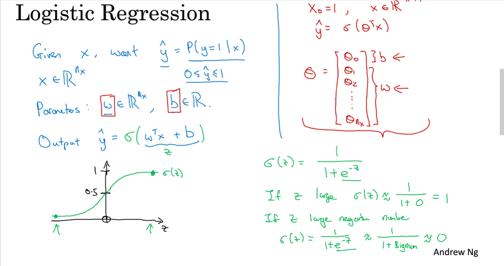
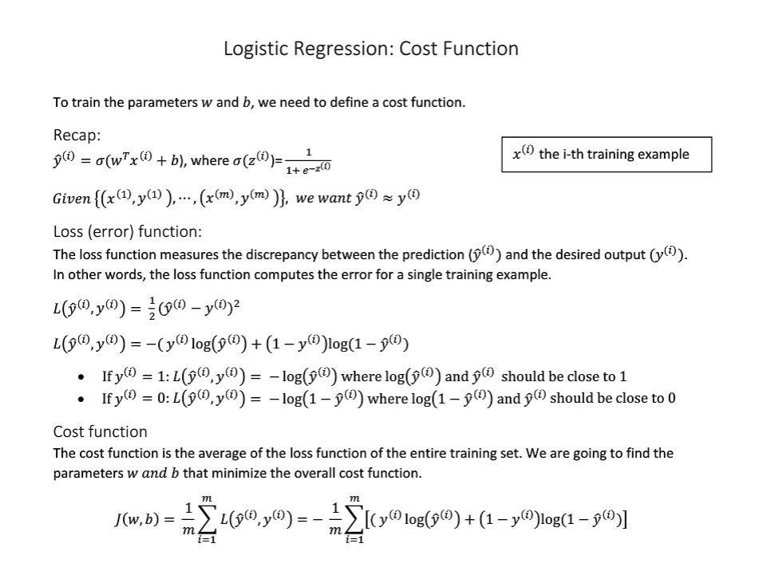
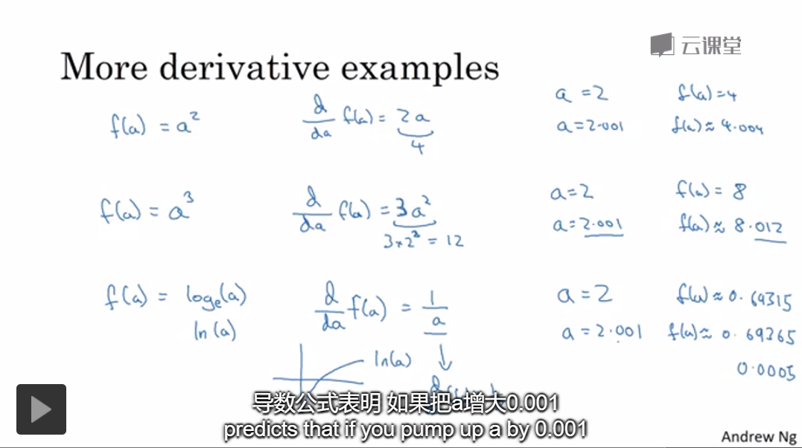
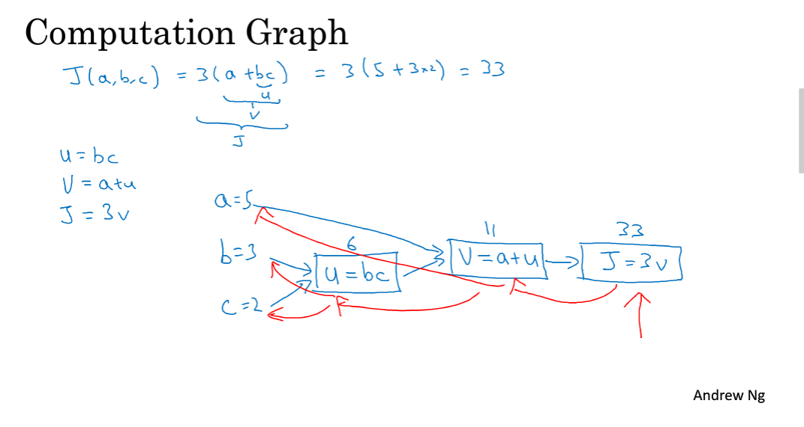
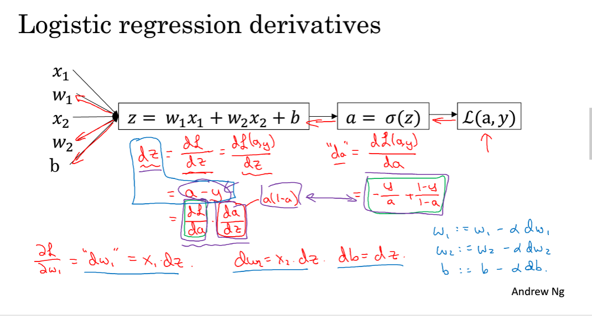
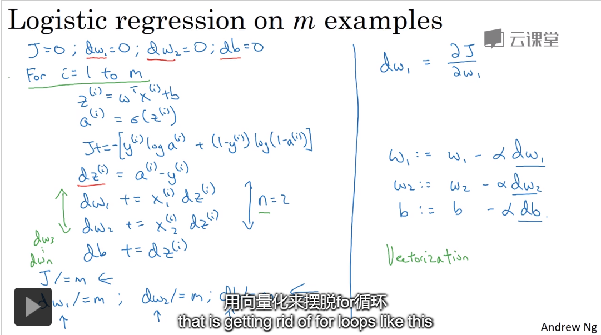

## 2019/11/26

### 2.1 二分分类:logistic(1 or o)，X.shape=(nx,m)

[补充：如何理解深度学习中的迭代，正向传播，反向传播？](https://www.zhihu.com/question/356580249)

### 2.2 logistic 回归,sigmod函数(1 or 0)

### 2.3 logistic 回归损失函数,成本函数 J(w,b)

## 2019/11/27

### 2.4 梯度下降法

### 2.5 导数 

导数即斜率 : d f(a)/d a

### 2.6 更多导数的例子

### 2.7 计算图
### 2.8 计算图的导数计算

反向传播计算梯度值，正向传播计算最终结果

### 2.9 logistic中的梯度下降法

先介绍损失函数的导数 da,再计算dz

### 2.10 m个样本的梯度下降法 

for 循环遍历这m个样本，效率太低，下节课引出向量化技术来解决效率的问题
