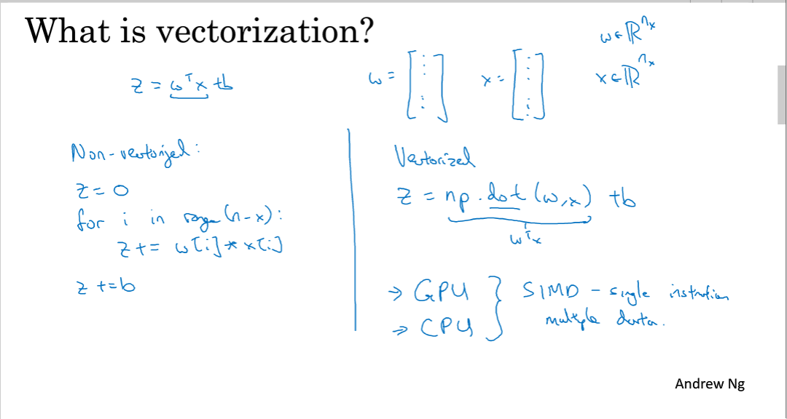
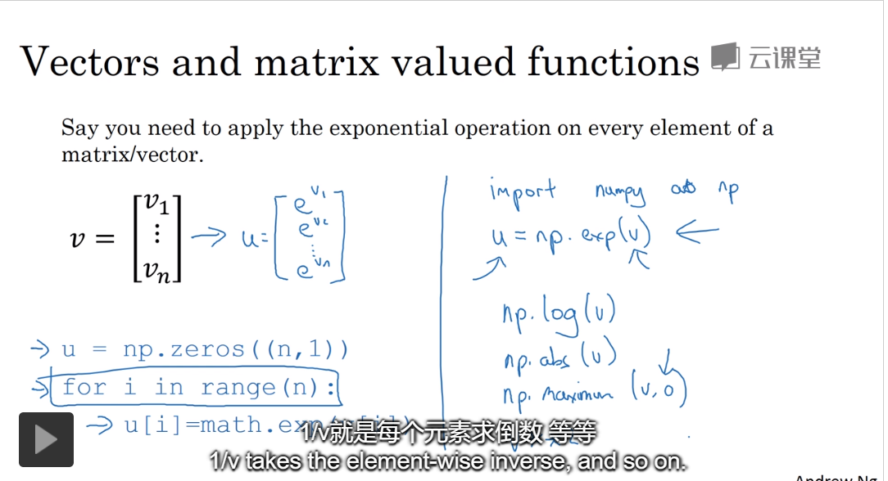
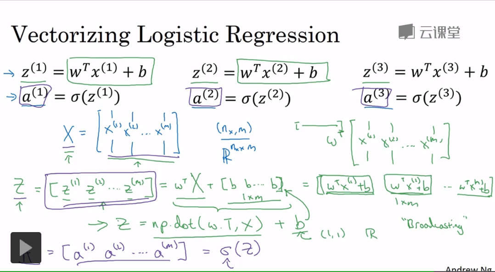
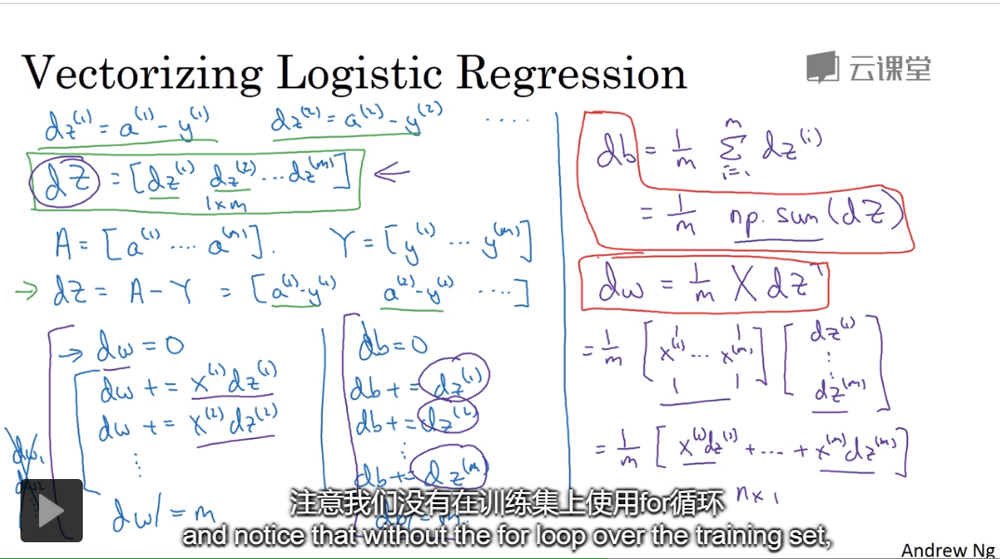
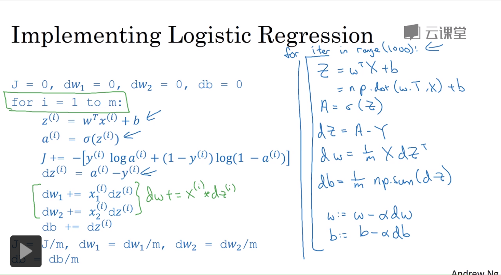
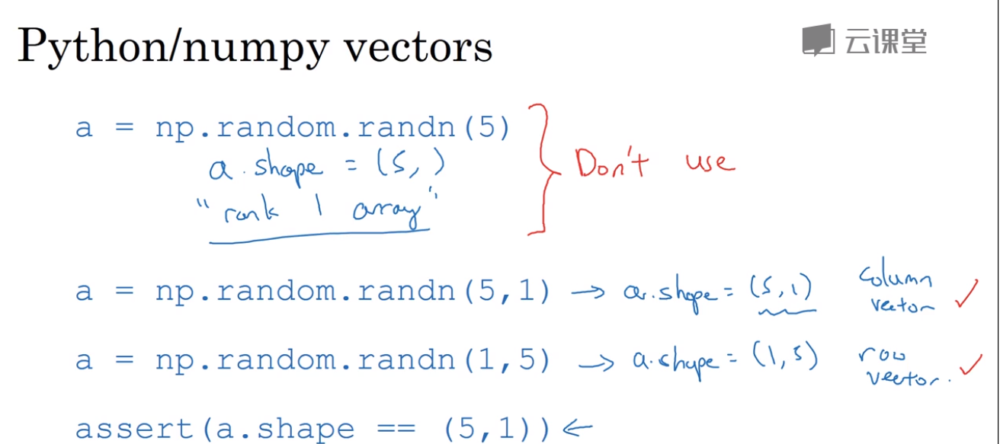
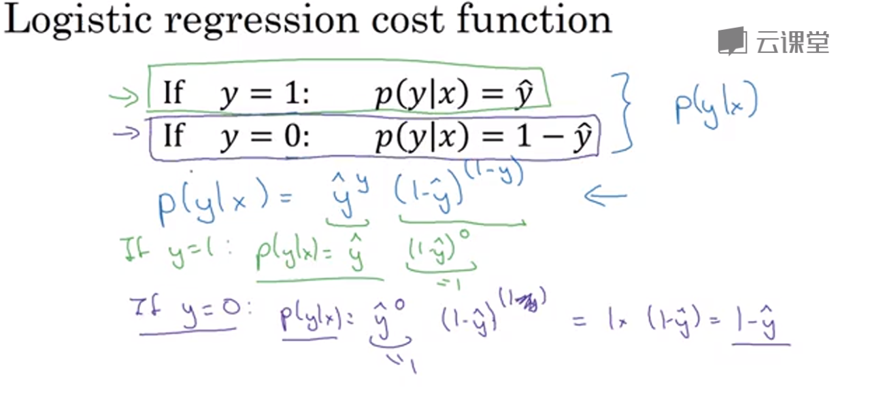

2019/11/28

### 2.11 向量化

np.dot()

### 2.12 向量化更多的例子

np.exp() np.log()

### 2.13 向量化logistic回归

### 2.14 向量化logistic回归的梯度输出

m个训练数据的梯度

## 2019/11/29

### 2.15 python中的广播

    numpy 加法运算
    
### 2.16 python numpy 向量

### 2.17 jupyter notebook 的使用

### 2.18 （选修）logistic 损失函数的解释

