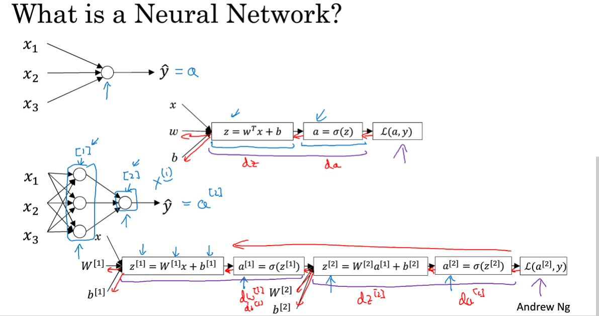
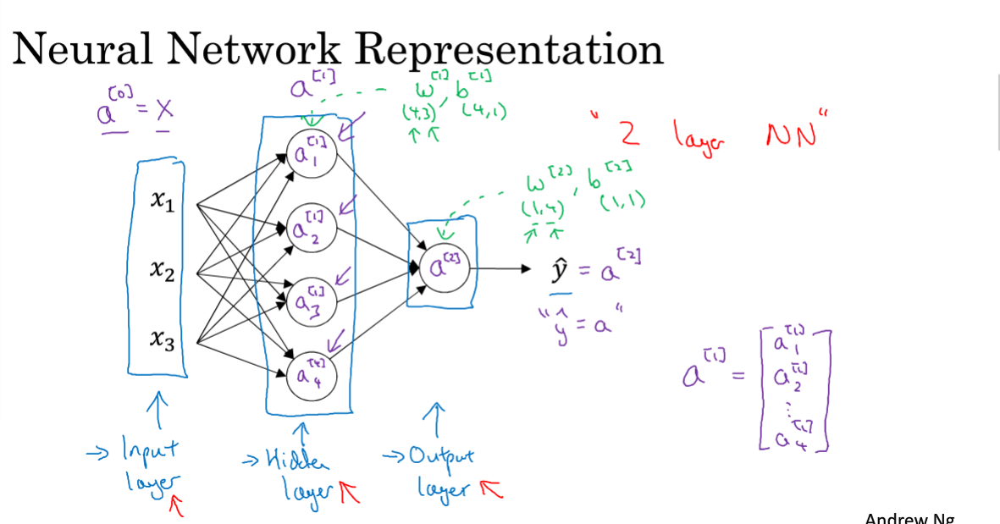
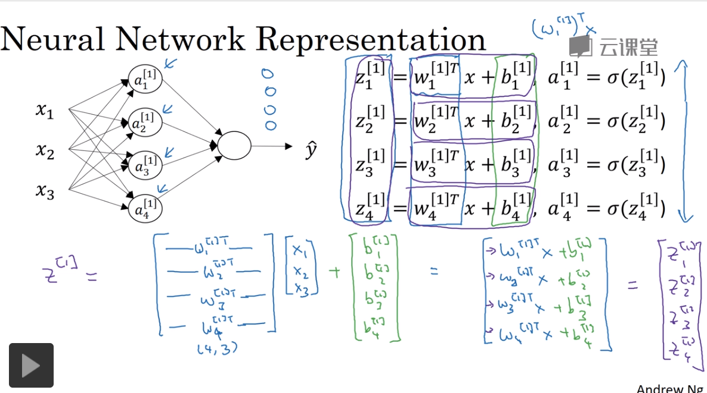

### 2019/11/29

### 3.1 神经网络概览

z 方程 a 是预测值 L 损失函数



### 3.2 神经网络表示：双层神经网络



### 3.3 计算神经网络的输出

神经网络到底在计算什么，怎么输入x的，怎么得到y的



### 复习2019/11/19--2019/11/24 学习的pytorch 中文手册

```python
import torch.nn as nn
import torch.nn.functional as F
import torch.optim

x = self.conv1(x) #卷积
x = F.relu(x) # 激活
x = F.max_pool2d(x, (2,2)) #池化
x = F.relu(x)
x = x.view(x.size()[0],-1)
x = self.fc1(x)
self.fc1(x) = nn.Linear(1350,10)```

```python
for parameters in net.parameters():
    print()
    
# 在反向传播前，要先将所有参数的梯度清零
net.zero_grad()
out.backward(torch.ones(1,10))

# 损失函数
criterion = nn.MSELoss()
loss = criterion(out,y)
print(loss.item())

# 新建优化器
optimizer = torch.optim.SGD(net.parameters(),lr=0.01)
# 更新参数
optimizer.step()```