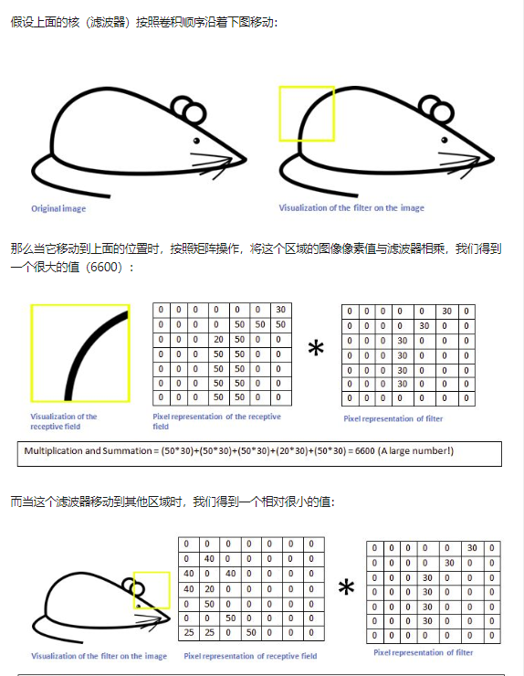

### CNN

[卷积神经网络简介](https://github.com/zergtant/pytorch-handbook/blob/master/chapter2/2.4-cnn.ipynb)

[能否对卷积神经网络工作原理做一个直观的解释？](https://www.zhihu.com/question/39022858)

在相当程度上，构建卷积神经网络的任务就在于构建这些滤波器。也就是，将这些滤波器变成这样(改变滤波器矩阵的值，也就是Weight)的——能识别特定的特征。这个过程叫做训练。

我们在输入矩阵上使用我们的权重矩阵进行滑动，每滑动一步，将所覆盖的值与矩阵对应的值相乘，并将结果求和并作为输出矩阵的一项，依次类推直到全部计算完成。



### logistic 回归实战
[logistic 回归](https://github.com/zergtant/pytorch-handbook/blob/master/chapter3/3.1-logistic-regression.ipynb)

```python
#!/usr/bin/env python
# coding: utf-8
import torch
import torch.nn as nn
import numpy as np

data = np.loadtxt("german.data-numeric")
print(data)

n, l = data.shape
print(n,l)

for j in range(l-1):
    meanVal = np.mean(data[:,j])
    stdVal = np.std(data[:,j])
    data[:,j] = (data[:,j] - meanVal) / stdVal

np.random.shuffle(data)

train_data=data[:900,:l-1]
train_lab=data[:900,l-1]-1
test_data=data[900:,:l-1]
test_lab=data[900:,l-1]-1

class LR(nn.Module):
    def __init__(self):
        super(LR,self).__init__()
        self.fc=nn.Linear(24,2) # 由于24个维度已经固定了，所以这里写24
    def forward(self,x):
        out=self.fc(x)
        out=torch.sigmoid(out)
        return out

def test(pred, lab):
    t = pred.max(-1)[1] == lab
    return torch.mean(t.float())

net=LR() 
criterion=nn.CrossEntropyLoss() # 使用CrossEntropyLoss损失
optm=torch.optim.Adam(net.parameters()) # Adam优化
epochs=1000 # 训练1000次

for i in range(epochs):
    
    net.train() # 训练
    
    x = torch.from_numpy(train_data).float() # Torch Tensor
    y = torch.from_numpy(train_lab).long()
    
    y_hat = net(x) # def forword
    
    loss = criterion(y_hat, y) #计算损失
    optm.zero_grad() #前一步的损失清零
    loss.backward() # 反向传播
    optm.step() # 优化
    if (i+1) % 100 ==0:
        net.eval() # 计算
        test_in = torch.from_numpy(test_data).float()
        test_l = torch.from_numpy(test_lab).long()
        test_out = net(test_in)
        accu = test(test_out, test_l)
        print("Epoch:{},Loss:{:.4f},Accuracy：{:.2f}".format(i+1,loss.item(),accu))

```