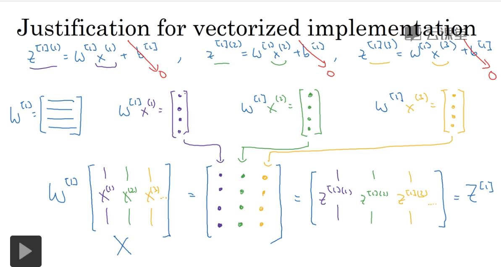
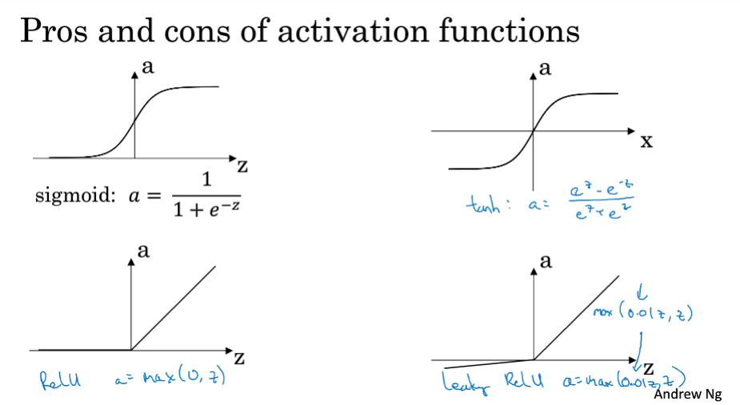
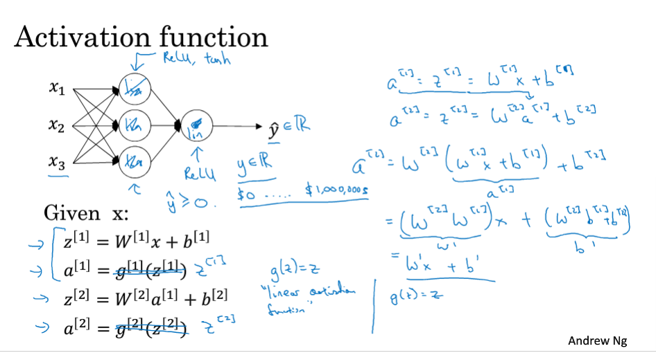

### 3.5 向量化实现的解释

### 3.6 激活函数

四种激活函数：sigmod tanh relu leaky

### 3.7 为什么需要非线性激活函数

    1. 如果使用Sigmod函数，使用线性激活函数，和没有任何隐藏层的标准逻辑Logisti回归一样
    2. 只有线性回归问题，才使用线性激活函数，如房价预测
    3. 在输出层可以使用线性激活函数，在隐层涉及到压缩等特殊情况时使用
    
