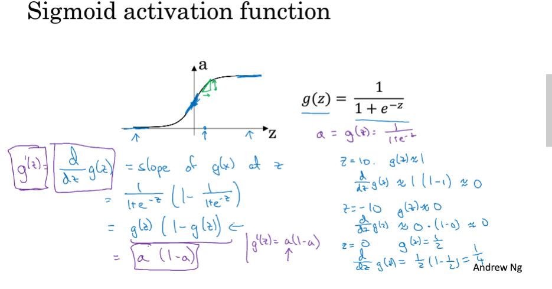
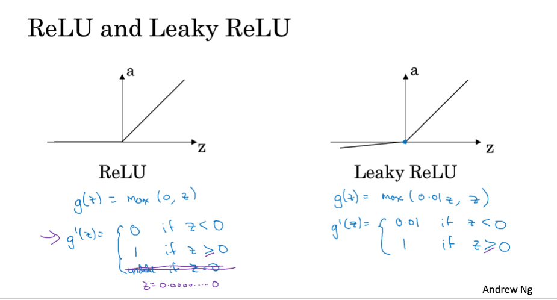
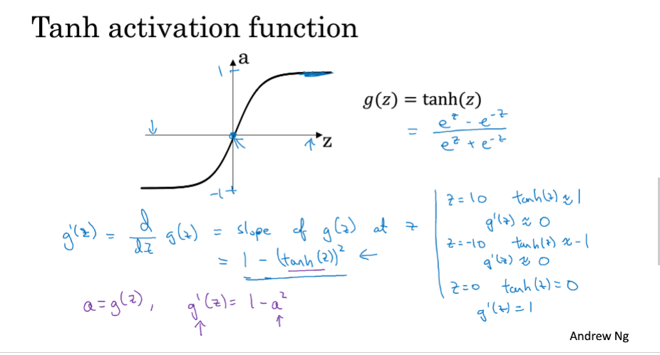
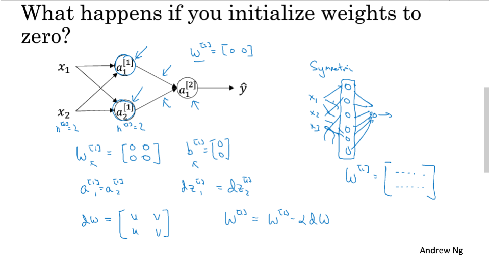
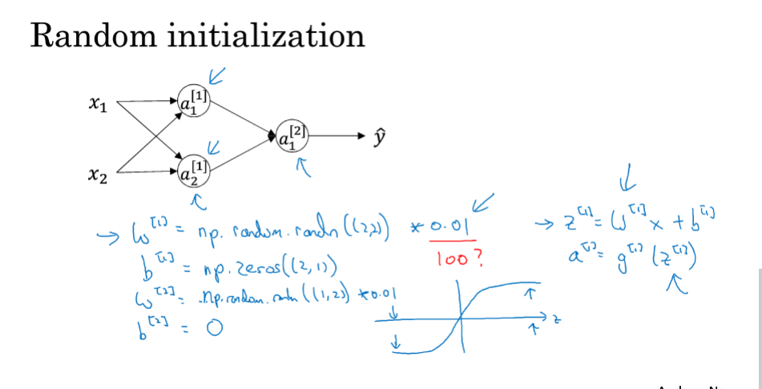

# 20191205 浅层神经网络

## 3.8 激活函数的导数

## 3.9 神经网络的梯度下降法

    Not Understand

## 3.11 随机初始化

## Pytorch 微调

[MNIST数据集手写数字识别实战](https://github.com/zergtant/pytorch-handbook/blob/master/chapter3/3.2-mnist.ipynb)

### 我们找到数据集，对数据做预处理，定义我们的模型，调整超参数，测试训练，再通过训练结果对超参数进行调整或者对模型进行调整。

针对于某个任务，自己的训练数据不多，那怎么办？ 没关系，我们先找到一个同类的别人训练好的模型，把别人现成的训练好了的模型拿过来，换成自己的数据，调整一下参数，再训练一遍，这就是微调（fine-tune）。

我们学了JAVA，再去学C#，或者Python，面向对象和设计模式是不用去学的，因为原理都是一样的，甚至在学习C#的时候语法都可以少学很多，这就是迁移学习的概念，把统一的概念抽象出来，只学习不同的内容。

迁移学习按照学习方式可以分为基于样本的迁移，基于特征的迁移，基于模型的迁移，以及基于关系的迁移，这里就不详细介绍了。

对于图片来说，我们CNN的前几层学习到的都是低级的特征，比如，点、线、面，这些低级的特征对于任何图片来说都是可以抽象出来的，所以我们将他作为通用数据，只微调这些低级特征组合起来的高级特征即可，例如，这些点、线、面，组成的是园还是椭圆，还是正方形，这些代表的含义是我们需要后面训练出来的。

### 下面只介绍下计算机视觉方向的微调，摘自 cs231

ConvNet as fixed feature extractor.： 其实这里有两种做法：

1. 使用最后一个fc layer之前的fc layer获得的特征，学习个线性分类器(比如SVM)
2. 重新训练最后一个fc layer
Fine-tuning the ConvNet
固定前几层的参数，只对最后几层进行fine-tuning,

### 注意事项

1. 新数据集和原始数据集合类似，那么直接可以微调一个最后的FC层或者重新指定一个新的分类器
2. 新数据集比较小和原始数据集合差异性比较大，那么可以使用从模型的中部开始训练，只对最后几层进行fine-tuning
3. 新数据集比较小和原始数据集合差异性比较大，如果上面方法还是不行的化那么最好是重新训练，只将预训练的模型作为一个新模型初始化的数据
4. 新数据集的大小一定要与原始数据集相同，比如CNN中输入的图片大小一定要相同，才不会报错
5. 如果数据集大小不同的话，可以在最后的fc层之前添加卷积或者pool层，使得最后的输出与fc层一致，但这样会导致准确度大幅下降，所以不建议这样做
6. 对于不同的层可以设置不同的学习率，一般情况下建议，对于使用的原始数据做初始化的层设置的学习率要小于（一般可设置小于10倍）初始化的学习率，这样保证对于已经初始化的数据不会扭曲的过快，而使用初始化学习率的新层可以快速的收敛。

